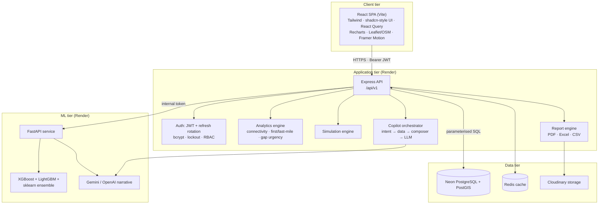

# URBANFLOW AI — System Architecture

## 1. Overview

URBANFLOW AI is a three-tier SaaS platform with a dedicated ML microservice:



## 2. Request lifecycle

1. **SPA** issues `/api/v1/*` with `Authorization: Bearer <access>`; 401 triggers a single
   refresh-token rotation and an automatic retry (no user friction).
2. **Express** pipeline: `helmet → cors allowlist → hpp → compression → JSON (1 mb) →
   rate-limit (300 rpm) → route validation (express-validator) → requireAuth →
   requireCapability (RBAC) → handler → { success, data, meta } envelope → errorHandler`.
3. **Analytics** are computed deterministically and transparently (published weight vectors),
   cached 60–90 s in Redis. Every score is auditable — essential for public-sector decisions.
4. **ML calls** go to the FastAPI service with an internal shared token. If unreachable, the
   backend's local gradient-ensemble fallback returns the same contract, so forecasting never
   fails hard.

## 3. Composite Connectivity Score

```
composite = 0.30 · distance_to_transit + 0.20 · frequency + 0.15 · reliability
          + 0.15 · safety + 0.20 · intermodal
first_mile = 0.65 · distance + 0.35 · intermodal
last_mile  = 0.50 · stop_density + 0.30 · safety + 0.20 · intermodal
accessibility = 0.50 · composite + 0.30 · last_mile + 0.20 · route_reach
transit_desert ⇔ composite < 0.35 ∨ walk_km > 1.2
```

## 4. Gap Urgency Index

```
urgency = 0.25 · population_density + 0.15 · economic_activity
        + 0.25 · vulnerability_index + 0.15 · growth_rate
        + 0.20 · connectivity_deficit
investment_hint = f(urgency, connectivity_deficit, ward_scale)
```

## 5. Forecasting pipeline (FastAPI)

`HistoryPoint[] → pandas frame → feature engineering (lag 1/2/7, rolling 3/7, calendar,
weather, holiday, event, trend) → XGBRegressor + LGBMRegressor + GradientBoostingRegressor
(mean ensemble) → recursive multi-step forecast → residual-spread 80 % confidence bands`.
Models cache by dataset signature (1 h TTL). Feature importances returned with every response.

## 6. Data model (PostGIS)

```
tenants ─< users ─< refresh_tokens
        ─< zones (MultiPolygon 4326, population, vulnerability, growth)
        ─< transit_points (Point, mode: bus|metro|bike_share|ev_charger|parking…)
        ─< routes (LineString, frequency, reliability, safety) ─< route_stops
        ─< ridership_observations (time-series facts + weather + events)
        ─< traffic_observations (speed, volume, congestion index)
        ─< connectivity_scores · gap_urgency_scores · demand_forecasts
        ─< recommendations · simulations · reports · notifications
        ─< copilot_messages · audit_logs
```

Every FK indexed; GiST on all geometries; composite indexes on
`(tenant_id, observed_at DESC)` for time-series scans. Migrations are ordered SQL files
tracked in `schema_migrations` (idempotent, transactional).

## 7. Deployment topology

| Component | Host | Build | Start | Health |
|-----------|------|-------|-------|--------|
| Frontend | Vercel | `npm run build` | static `dist/` + SPA rewrites | CDN edge |
| Backend | Render | `npm ci` | `node src/index.js` | `/health`, `/health/ready` |
| AI service | Render | `pip install -r requirements.txt` | `uvicorn app.main:app --host 0.0.0.0 --port 8000` | `/health` |
| Database | Neon | migrations via deploy job | managed | connection pool |
| Cache | Redis | managed (Render Key Value) | managed | ping |
| Storage | Cloudinary | managed | managed | signed URLs |

## 8. Failure modes & resilience

| Failure | Behaviour |
|---------|-----------|
| Postgres unreachable (non-prod) | Falls back to memory adapter with seeded dataset; logs warning |
| Redis unreachable | Falls back to in-process TTL cache |
| AI service unreachable | Backend local gradient-ensemble forecasts; copilot uses deterministic composer |
| Gemini/OpenAI unreachable or keys missing | Grounded deterministic answers (never hallucinated numbers) |
| Brute-force login | 8 failures → 15-minute lock + audit trail |
| Token theft replay | Refresh rotation revokes old tokens; replay returns 401 |

## 9. Security posture

Helmet + nosniff/frame/referrer headers · CORS allowlist · HPP · rate limiting (global +
stricter on auth) · express-validator on all writes · parameterised SQL exclusively · bcrypt
(cost 10+) · refresh tokens stored as sha256 hashes · RBAC capability matrix enforced server
side and mirrored in UI navigation · Bearer tokens (no cookies ⇒ CSRF-immune) · secrets via
environment only · audit log for privileged actions.
